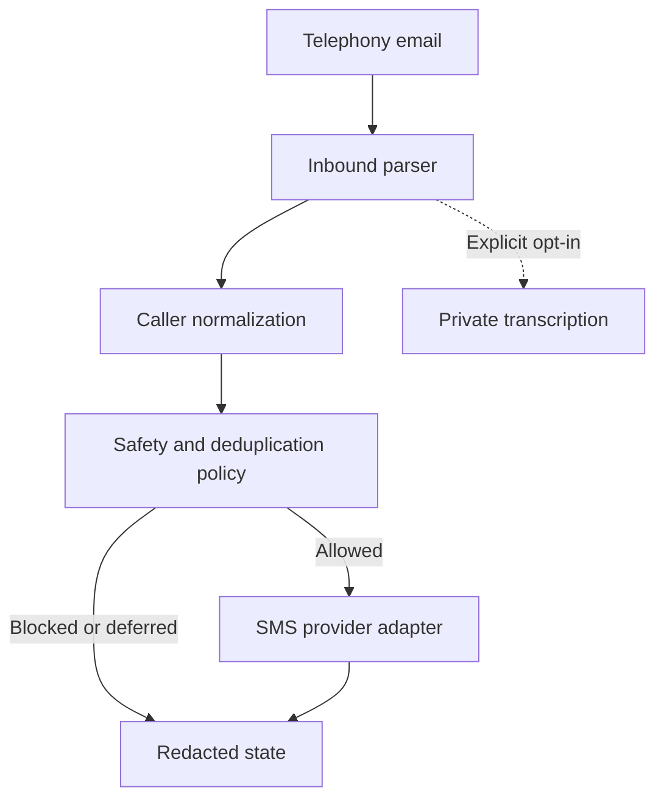

# Voicemail → Caller SMS Auto-Reply

[](https://github.com/christosdvm/Voicemail-SMS-Auto-Reply/actions/workflows/ci.yml)
[](LICENSE)
[](https://script.google.com/)
[](package.json)

A privacy-conscious workflow automation system that turns voicemail and missed-call notification emails into safe, deterministic SMS acknowledgements to the original caller.

[Try the local demo](#try-it-without-credentials) · [Install](#installation) · [Configuration](docs/CONFIGURATION.md) · [Case study](docs/CASE_STUDY.md) · [Design decisions](docs/decisions/README.md) · [Operations](docs/OPERATIONS.md) · [Roadmap](ROADMAP.md)

> This is not voicemail-to-text messaging. The caller receives configured acknowledgement text; voicemail audio and transcripts never determine the outbound SMS.


---

## At a glance

| Area | What this repository demonstrates |
| --- | --- |
| Product thinking | A real clinical operations problem translated into explicit workflow rules and safe rollout states. |
| Automation architecture | Gmail polling, event classification, phone-number normalization, send-window policy, deduplication, and provider adapters. |
| Privacy engineering | Redacted state, hashed identifiers, bounded retention, opt-in transcription, and no committed real caller data. |
| Reliability design | Locking, pre-send reservations, dry-run defaults, one-shot live activation, ambiguous-delivery handling, and synthetic tests. |
| Portfolio value | A small but complete professional workflow product rather than a tutorial script or disconnected code sample. |

## Why I built it

The first version solved a small but real operational problem: voicemail notifications arrived reliably by email, but callers had no immediate confirmation that their message had reached anyone.

The obvious implementation is a short script that reads a number and calls an SMS API. The useful implementation also has to answer harder questions: Is this really a caller number? Has this person already received a reply? Did a missed call turn into a voicemail? What happens if the provider times out after accepting the SMS? How can the workflow be tested without contacting a real person?

Those questions shaped the project. The result is deliberately conservative automation for low-volume, human-owned workflows—not a claim to be a high-scale messaging platform.

The original deployment used Modulus. Modulus is now one optional adapter; the policy and parsing layers do not depend on it.

## What reviewers should notice

This project is intentionally designed to show more than basic scripting ability.

- **Workflow modelling:** inbound events are classified before action is allowed.
- **Safety by default:** installation starts disabled and dry-run-first.
- **Provider abstraction:** SMS vendors sit behind a small adapter boundary.
- **Idempotency awareness:** message and caller state reduce duplicate replies across repeated runs.
- **Privacy-first defaults:** identifiers are masked or hashed, and transcription is optional and isolated from outbound messaging.
- **Operational humility:** the README documents boundaries instead of pretending Apps Script is a high-scale messaging platform.

## What the workflow does



The processing path is predictable:

1. Gmail finds a message that matches the configured query, subject rules, and optional sender allowlist.
2. The parser extracts and normalizes the caller number to E.164.
3. Policy checks apply activation boundaries, test-recipient locking, send windows, missed-call delay, and caller cooldown.
4. A delivery reservation is recorded before any live provider request.
5. The selected adapter sends fixed text and returns a redacted result.
6. Hashed operational state is retained for a bounded period and then removed.

## Design choices that matter

| Decision | Reason |
| --- | --- |
| Dry run is the starting state | Installation should never send a message merely because OAuth succeeded. |
| External SMS text is deterministic | Acknowledgements must be reviewable, testable, and independent of transcript content. |
| Ambiguous delivery is not retried automatically | A timeout can occur after a provider accepted the SMS; retrying may contact the caller twice. |
| Message IDs and caller numbers become hashes in state | Deduplication does not require retaining the raw identifiers. |
| Provider code sits behind a small adapter boundary | Inbound telephony and outbound SMS vendors can change independently. |
| Local-format numbers require an explicit country code | Guessing a country is unsafe in a reusable public project. |

The longer rationale is recorded as short [architecture decision records](docs/decisions/README.md), including the consequences and limits of each choice.

## Portfolio reading path

For a quick professional review, read the repository in this order:

1. **README** — product summary, workflow, installation and boundaries.
2. **[Engineering case study](docs/CASE_STUDY.md)** — problem framing, architecture, trade-offs and verification strategy.
3. **[Security](SECURITY.md) and [Privacy](PRIVACY.md)** — data-handling assumptions, deployment risks and reporting guidance.
4. **[Operations runbook](docs/OPERATIONS.md)** — safe setup, rollout, manual tests, rollback and recovery.
5. **[`src/`](src/)** — ordered Apps Script modules and policy implementation.
6. **[`tests/`](tests/)** — offline harness and synthetic fixtures.

## Try it without credentials

Node.js 20 or newer is enough to run a synthetic end-to-end walkthrough. It reads only committed fixtures, masks caller numbers, and makes no Gmail or provider request.

```bash
git clone https://github.com/christosdvm/Voicemail-SMS-Auto-Reply.git
cd Voicemail-SMS-Auto-Reply
npm run demo -- all
```

Available scenarios:

```bash
npm run demo -- voicemail
npm run demo -- missed-call
npm run demo -- duplicate
```

Each result exposes the event type, masked caller, policy decision, and whether delivery was attempted. This gives reviewers a useful path through the system without asking for access to a Google account or SMS provider.

## Supported adapters

| `SMS_PROVIDER` | Configuration |
| --- | --- |
| `webhook` | `GENERIC_SMS_API_URL`; optional bearer token or API key |
| `twilio` | Account SID, auth token, and sender or Messaging Service SID |
| `vonage` | API key, API secret, and sender |
| `telnyx` | API key and sender number |
| `modulus` | API key and sender ID |

Every adapter uses the same upstream policy layer. Modulus also has an optional inbound-email preset for its notification format; neither feature is required by the rest of the project. See [provider adapters](docs/provider-adapters.md).

## Installation

### 1. Create an Apps Script project

Create a project at [script.google.com](https://script.google.com/) and choose one deployment path:

- Copy the generated `Code.gs` and `appsscript.json` files into the project.
- Or use `clasp` after creating a local `.clasp.json` that is never committed.

`Code.gs` is a generated, copy-paste-friendly deployment artifact. Development happens in the ordered files under `src/`; `npm run build` reproduces the bundle exactly.

### 2. Initialize safely

Run `initializeWithoutSending()` once and complete Google's OAuth consent flow. Initialization:

- starts with `AUTOMATION_ENABLED=false`;
- starts with `SMS_DRY_RUN=true`;
- does not select an SMS provider account;
- does not enable transcription or internal notifications;
- records an activation boundary so older emails are ignored.

### 3. Configure the source and destination

At minimum, review these Apps Script **Project Settings → Script Properties**:

| Property | Purpose |
| --- | --- |
| `GMAIL_QUERY` | Select only the intended notification emails. |
| `VOICEMAIL_SUBJECT_PATTERN` | Classify voicemail subjects. |
| `MISSED_CALL_SUBJECT_PATTERN` | Classify missed-call subjects. |
| `CALLER_NUMBER_LABELS` | Identify labelled caller numbers in message text. |
| `DEFAULT_COUNTRY_CODE` | Normalize local numbers; leave empty if all inputs are already E.164. |
| `EXCLUDED_PHONE_NUMBERS` | Exclude known destination or office numbers from extraction. |
| `SMS_PROVIDER` | Select an outbound adapter. |
| `SMS_REPLY_TEXT` | Fixed acknowledgement sent after a voicemail. |

The complete reference and a synthetic JSON example are in [docs/CONFIGURATION.md](docs/CONFIGURATION.md) and [`config/example-script-properties.json`](config/example-script-properties.json).

For Modulus-formatted email, run `configureModulusEmailPreset()` after initialization. It configures the known subjects, sender allowlist, Greek country code, and caller-number preference. It does not select Modulus as the SMS provider.

### 4. Prove the safe path first

Run, in order:

1. `runSelfTests()`
2. `showStatus()`
3. `processNewVoicemailsNow()` while `SMS_DRY_RUN=true`
4. `prepareSingleRecipientTest()` with an owner-controlled `TEST_PHONE`
5. `runOwnerVoicemailLiveTest()` only after setting the one-shot `LIVE_TEST_CONFIRMATION=YES`

For production, use `activateProductionAutomation()` with `PRODUCTION_ACTIVATION_CONFIRMATION=ENABLE`. The confirmation is consumed once. See the [operations runbook](docs/OPERATIONS.md) for states, recovery rules, and rollback.

## Source layout

```text
src/                         Ordered Apps Script source modules
Code.gs                      Generated deployment bundle
scripts/build.mjs            Reproducible bundle builder
scripts/simulate.mjs         Credential-free synthetic walkthrough
scripts/check-public-safety.mjs
                             Repository secret/media guardrail
tests/run-tests.mjs          Offline behavior and safety tests
tests/helpers/               Apps Script runtime test harness
tests/fixtures/              Synthetic inbound email examples
docs/CASE_STUDY.md           Engineering case study for portfolio review
docs/decisions/              Architecture decision records
```

The numbered source files make load order explicit while keeping Apps Script's global-function model visible. The bundle check in CI prevents `src/` and `Code.gs` from drifting apart.

## Development

The project has no runtime npm dependencies.

```bash
npm run build       # regenerate Code.gs from src/
npm test            # parser, policy, provider, privacy, and signing tests
npm run safety      # scan the repository for common secret/private-media patterns
npm run repository:check
                    # verify documentation links and committed JSON
npm run validate    # run every local and CI check
```

CI runs the complete validation path on maintained Node.js lines. Live provider tests stay outside CI by design: an automated test must never send a real SMS.

## Current boundaries

- Gmail polling is appropriate for small operational workflows, not high-throughput event ingestion.
- Apps Script Properties provide bounded operational state, not a durable queue or analytics store.
- Generic extraction cannot infer which of several unlabelled phone numbers is the caller. Configure `EXCLUDED_PHONE_NUMBERS` or `CALLER_NUMBER_PREFERENCE_PATTERN` for that provider.
- Provider acceptance is not the same as handset delivery. Delivery receipts require a provider-specific callback service.
- Compliance still depends on the deployer's notices, lawful basis, retention policy, access controls, and provider agreements.

These limits are intentional and documented instead of hidden behind broad claims. The [roadmap](ROADMAP.md) describes a typed core, event-driven ingestion, delivery receipts, and redacted observability as separate future steps.

## Security and privacy

Credentials belong only in Apps Script Properties. Do not place API keys, caller details, audio, transcripts, or real email samples in commits or issues.

Read [SECURITY.md](SECURITY.md) before deployment and [PRIVACY.md](PRIVACY.md) before processing real notifications. Vulnerabilities should be reported privately through the repository's Security page.

## Contributing

Start with [CONTRIBUTING.md](CONTRIBUTING.md). Pull requests are expected to include a reproducible synthetic case, a delivery/privacy impact note, and `npm run validate` output.

## License

MIT — see [LICENSE](LICENSE).