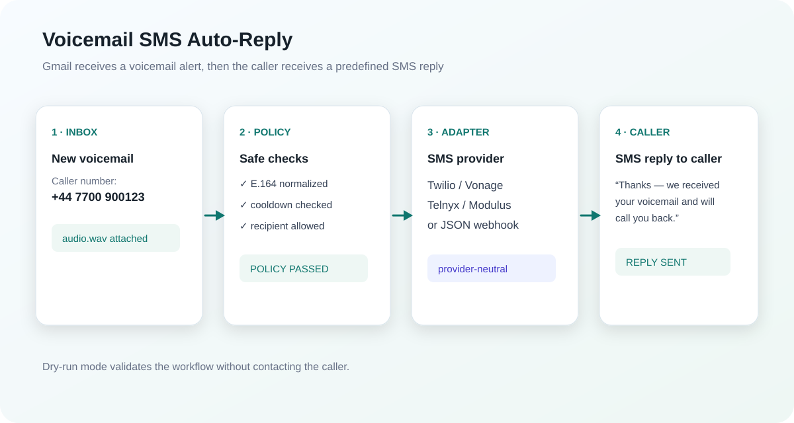
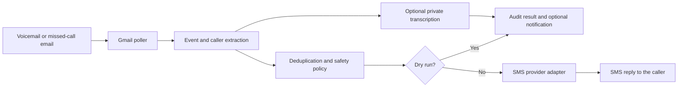

# Voicemail → Caller SMS Auto-Reply

[](https://github.com/christosdvm/Voicemail-SMS-Auto-Reply/actions/workflows/ci.yml)
[](LICENSE)
[](https://script.google.com/)

Automatically sends a configurable SMS reply to callers when Gmail receives a voicemail or missed-call notification.

[Installation](#installation) · [Architecture](#architecture) · [Provider adapters](docs/provider-adapters.md) · [Engineering case study](docs/CASE_STUDY.md) · [Roadmap](ROADMAP.md) · [Security](SECURITY.md)

> **This is an auto-reply workflow, not voicemail-to-text conversion.** It extracts the caller's phone number from the notification and sends a predefined acknowledgement. Voicemail audio or transcript content is never copied into the caller-facing SMS.

This provider-neutral Google Apps Script project is designed as a public reference implementation and portfolio project. It works with any email-based telephony source that exposes a caller number, and it can send through several SMS API styles.

> **Modulus is optional.** Modulus is implemented as one provider adapter and one compatibility preset for Modulus-formatted email notifications. A Modulus account is not required: the same workflow supports Twilio, Vonage, Telnyx, or a generic JSON SMS webhook.



## Why this project exists

Many telephony systems report voicemails and missed calls by email, while callers expect a quick acknowledgement on their phone. Connecting those systems safely is harder than a simple “send SMS” script: the workflow must extract unreliable caller data, avoid duplicate replies, isolate provider credentials, handle uncertain API outcomes, and minimize retained personal data.

This project packages those concerns into a provider-neutral reference implementation with conservative defaults. For the design constraints, failure model, and trade-offs, read the [engineering case study](docs/CASE_STUDY.md).

| Stage | Responsibility |
| --- | --- |
| Ingest | Poll Gmail using explicit OAuth scopes and configurable matching rules |
| Understand | Classify the event and extract/normalize the caller number |
| Decide | Apply deduplication, cooldown, time-window, and recipient safeguards |
| Deliver | Send a fixed acknowledgement through the selected SMS adapter |
| Retain | Store only hashed operational state and purge it automatically |

## What it does

- Polls Gmail for voicemail and missed-call notifications with an installable time-driven trigger.
- Classifies voicemail and missed-call messages using configurable subject patterns.
- Extracts caller numbers from labels, message text, sender fields, and attachment filenames.
- Normalizes international and local numbers to E.164 using `DEFAULT_COUNTRY_CODE`.
- Waits before replying to a missed call so a following voicemail can suppress the duplicate.
- Suppresses repeated replies to the same caller during a configurable cooldown.
- Supports dry-run, one-recipient test locking, explicit live-test confirmation, and no automatic retry after uncertain provider responses.
- Applies a configurable live-only SMS send window (09:00–21:00 Europe/Athens by default) and defers eligible messages outside it.
- Requires separate, one-shot confirmation for production activation and manual live processing.
- Sends a fixed, non-clinical acknowledgement SMS back to the original caller. Transcripts never change the caller-facing message.
- Optionally sends a masked internal notification. Audio transcription is off by default and requires explicit privacy settings.
- Provides optional private call-tracking links signed with HMAC.
- Retains only hashed operational state and purges old state automatically; retention is configurable.

## Engineering highlights

- **Provider abstraction:** Modulus, Twilio, Vonage, Telnyx, and generic webhook adapters share one redacted result contract.
- **Defensive delivery:** pre-send reservations and explicit ambiguous states reduce duplicate SMS risk when a provider response is uncertain.
- **Privacy by default:** transcription and internal transcript sharing are disabled; phone numbers are masked and state keys are hashed.
- **Operational safety:** dry-run, one-recipient locking, send windows, one-shot confirmations, and overlapping-run locks protect live environments.
- **Portable verification:** the Apps Script behavior is exercised offline by Node-based parser, policy, provider, privacy, and signing tests across supported Node versions in CI.

## Architecture



The runtime is a single `Code.gs` Apps Script file so it can be pasted into a new Apps Script project. `tests/run-tests.mjs` executes the pure parsing, policy, provider-selection, privacy, and signing checks offline.

## Supported provider adapters

| `SMS_PROVIDER` | Required Script Properties |
| --- | --- |
| `modulus` | `MODULUS_API_KEY`, `SMS_SENDER_ID` |
| `twilio` | `TWILIO_ACCOUNT_SID`, `TWILIO_AUTH_TOKEN`, and `TWILIO_FROM` or `TWILIO_MESSAGING_SERVICE_SID` |
| `vonage` | `VONAGE_API_KEY`, `VONAGE_API_SECRET`, `VONAGE_FROM` |
| `telnyx` | `TELNYX_API_KEY`, `TELNYX_FROM` |
| `webhook` | `GENERIC_SMS_API_URL`; optional `GENERIC_SMS_API_OAUTH_TOKEN` or `GENERIC_SMS_API_KEY` |

The adapter contract is intentionally small: normalize the destination, submit the text, accept only a successful provider response, and return a redacted provider result. To add another provider, implement a `sendSmsVia..._` function and add it to `sendSms_()` and `getSmsProviderRequirements_()`.

## Installation

### 1. Create the Apps Script project

1. Create a new project at [script.google.com](https://script.google.com/).
2. Copy `Code.gs` into the project.
3. If using `clasp`, copy `appsscript.json` as the manifest. The manifest uses UTC and explicit Gmail/external-request/mail/trigger OAuth scopes.
4. Run `initializeWithoutSending()` once and complete the Google OAuth consent flow.

Apps Script handles Gmail OAuth for the account running the project. The script does not ask for a password or store a Google refresh token in this repository.

### 2. Configure the email source

The safe default expects a Gmail label named `voicemail-sms-auto-reply` and generic subjects containing `voicemail`, `voice message`, or `missed call`.

Set these Script Properties for another source:

| Property | Example |
| --- | --- |
| `GMAIL_QUERY` | `label:voicemail-sms-auto-reply -in:spam -in:trash newer_than:30d` |
| `VOICEMAIL_SUBJECT_PATTERN` | `voicemail|voice message|φωνητικό μήνυμα` |
| `MISSED_CALL_SUBJECT_PATTERN` | `missed call|unanswered call|αναπάντητη κλήση` |
| `CALLER_NUMBER_LABELS` | `caller number|from number|phone|Από τον αριθμό` |
| `DEFAULT_COUNTRY_CODE` | `30` or `44`, without `+` |
| `ALLOWED_SENDER_EMAILS` | Optional exact sender allowlist, separated by `|` or `,` |

For Modulus-formatted emails, run `configureModulusEmailPreset()` after initialization. This changes only the inbound parser/query settings; it does not require the Modulus SMS adapter.

### 3. Configure SMS and privacy controls

Set provider credentials only in Apps Script **Project Settings → Script Properties**. Never put secrets in `Code.gs`, README files, fixtures, issues, or commits.

Useful controls:

| Property | Default | Purpose |
| --- | --- | --- |
| `SMS_PROVIDER` | `modulus` | Selects the adapter; change this for other providers |
| `SMS_DRY_RUN` | `true` | Records decisions without sending an SMS |
| `AUTOMATION_ENABLED` | `false` | Master switch for the trigger |
| `TEST_RECIPIENT_LOCK_ENABLED` | `false` | Restricts sends to `TEST_PHONE` |
| `PHONE_REPLY_COOLDOWN_HOURS` | `24` | Prevents repeated replies to one caller |
| `MISSED_CALL_DELAY_MINUTES` | `15` | Gives a caller time to leave a voicemail |
| `TRANSCRIPTION_ENABLED` | `false` | Allows sending audio to the configured transcription API |
| `INTERNAL_NOTIFICATION_INCLUDE_TRANSCRIPT` | `false` | Allows transcript text in internal email |
| `NOTIFICATION_EMAIL` | empty | Explicit destination for internal notifications |
| `SMS_SEND_WINDOW_ENABLED` | `true` | Enable the live-only send window |
| `SMS_SEND_START_HOUR` | `9` | Local start hour, inclusive |
| `SMS_SEND_END_HOUR` | `21` | Local end hour, exclusive |
| `SMS_SEND_TIME_ZONE` | `Europe/Athens` | IANA time zone used for the send window |
| `MAX_SMS_SEGMENTS` | `1` | Maximum allowed SMS segments per acknowledgement |
| `STATE_RETENTION_DAYS` | `35` | Retention limit for hashed state metadata |

The script no longer auto-selects the account owner as a notification recipient. Set `NOTIFICATION_EMAIL` deliberately if internal notifications are wanted.

### 4. Test safely

Run these functions in order:

1. `runSelfTests()` — fully offline parser and safety checks.
2. `showStatus()` — redacted configuration report.
3. Keep `SMS_DRY_RUN=true` and run `processNewVoicemailsNow()` against synthetic or test emails.
4. For a single live recipient, set `TEST_PHONE`, run `prepareSingleRecipientTest()`, then use the one-shot `runOwnerVoicemailLiveTest()` only with `LIVE_TEST_CONFIRMATION=YES`. It processes the oldest eligible voicemail and restores DRY RUN in all cases.
5. Set `SMS_DRY_RUN=false` only after the dry-run results, provider credentials, sender identity, and recipient policy have been verified.
6. Run `activateAutomation()` to install one one-minute trigger in DRY RUN.
7. For production, set `PRODUCTION_ACTIVATION_CONFIRMATION=ENABLE` once and run `activateProductionAutomation()`. This validates the provider, resets the activation boundary to “now,” installs the trigger, and only then enables live mode.

For a manual live run while automation is paused, set `MANUAL_LIVE_CONFIRMATION=YES` once and run `processNewVoicemailsNow()`. Live processing is blocked outside the configured send window. Use `cleanupOldStateNow()` for an explicit state cleanup.

`testLatestMatchingEmail()` and `testLatestMissedCallEmail()` are read-only checks. They do not send SMS. `testSmsProvider()` is the explicit, one-shot live provider check; `testModulusSms()` remains as a backwards-compatible alias.

## Deduplication behavior

The workflow applies multiple independent safeguards:

- Each Gmail message is stored under a hash of its message ID. Terminal states are not processed again.
- A missed call is delayed and suppressed if a related voicemail arrives from the same caller.
- A successful SMS records only a hash of the normalized number and the send time. Additional messages from that caller are suppressed during `PHONE_REPLY_COOLDOWN_HOURS`.
- A send reservation is written before a live provider request. A provider response that is ambiguous is marked for review and remains inside the cooldown, avoiding accidental duplicate SMS messages.
- `LockService` prevents overlapping trigger executions.

## Security and privacy

See [SECURITY.md](SECURITY.md) and [PRIVACY.md](PRIVACY.md). The important defaults are:

- secrets are read from Script Properties;
- dry-run is enabled on initialization;
- transcription is disabled by default;
- transcript inclusion in internal email is disabled by default;
- internal phone display is masked;
- state stores hashes, timestamps, statuses, and masked numbers rather than raw caller numbers or transcripts;
- state is automatically purged after the configured retention period;
- HMAC call-action links contain no phone number and expire;
- the client receives a fixed acknowledgement, not AI-generated medical or veterinary advice.

This is an automation component, not a compliance program. Before production use, review your legal basis, notices, retention policy, processor agreements, access controls, and local rules for voicemail, communications, and health-related information.

## Tests and development

Requirements: Node.js 18+ for the offline test runner.

```bash
npm test
node --check < Code.gs
```

All fixtures use synthetic numbers and domains. No provider request, Gmail read, transcription request, or SMS is made by the Node test suite.

## Project structure

```text
Code.gs                         Apps Script runtime
appsscript.json                 Apps Script manifest and OAuth scopes
tests/run-tests.mjs             Offline test runner
tests/fixtures/                 Synthetic provider examples
docs/demo.svg                   Anonymized workflow illustration
SECURITY.md                     Vulnerability reporting and hardening
PRIVACY.md                      Data-flow and retention notes
CHANGELOG.md                    Release history
```

## Version

The current source version is `v1.3.1`. See [CHANGELOG.md](CHANGELOG.md) for the version history.

Planned work is tracked in the public [roadmap](ROADMAP.md) and repository issues. Roadmap items describe direction, not committed delivery dates.

## License

MIT — see [LICENSE](LICENSE).
