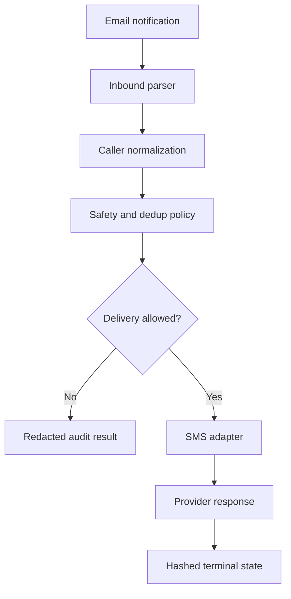

# Engineering case study

## Summary

Voicemail and missed-call notifications often arrive as semi-structured email, but the useful follow-up channel is SMS. This project turns those notifications into a safe acknowledgement to the original caller while remaining independent of any single telephony or SMS vendor.

The interesting engineering problem is not the HTTP request. It is deciding whether a message should be sent, to whom, and exactly once enough for a real operational workflow.

## Goals

- Accept generic or provider-specific email notifications.
- Extract and normalize a caller number without trusting one fixed template.
- Support multiple SMS APIs behind a small adapter contract.
- Make accidental live sends difficult during setup and testing.
- Avoid duplicate replies across repeated notifications and overlapping runs.
- Minimize stored personal data and keep transcription optional.
- Remain deployable as a copy-paste Google Apps Script project.

## Non-goals

- Sending voicemail transcripts to callers.
- Generating advice or free-form responses from voicemail content.
- Acting as a complete consent or regulatory-compliance system.
- Replacing a queue-backed messaging platform at high scale.

## Constraints

### Semi-structured input

Providers use different subjects, body labels, sender formats, and attachment names. The parser therefore uses configurable subject patterns and caller labels, then applies normalization and validation before a number becomes eligible.

### At-least-once execution

Time-driven triggers can overlap or be rerun. Gmail messages can also be repeated or reclassified. The workflow treats processing as at-least-once and builds idempotency at the message and caller levels.

### Uncertain external outcomes

An HTTP timeout does not prove that an SMS failed. Automatically retrying an uncertain request could send duplicates, so the workflow records a reservation before delivery and sends ambiguous outcomes to manual review.

### Sensitive data

Caller numbers, audio, and transcripts may be personal data. The default path avoids transcription, masks internal displays, hashes state keys, and removes old state on a configurable schedule.

## Architecture

Development happens in ordered modules under `src/`. A dependency-free build step generates one `Code.gs` file for low-friction Apps Script deployment, and CI verifies that source and bundle have not drifted.

## Reliability model

| Failure mode | Design response |
| --- | --- |
| Trigger overlap | `LockService` permits one active processor |
| Same Gmail message seen again | Hashed message state suppresses terminal work |
| Missed call followed by voicemail | Delayed missed-call handling lets voicemail suppress it |
| Same caller contacts repeatedly | Configurable caller cooldown limits repeat acknowledgements |
| Provider timeout or malformed response | Mark as ambiguous; do not retry automatically |
| Manual live execution by mistake | Require one-shot confirmation and an active send window |
| Configuration drift | Redacted status and validation functions expose missing settings |

This is deliberately “exactly-once enough” rather than a claim of distributed exactly-once delivery. Provider-side idempotency keys and a durable queue would be the next step for a higher-scale deployment.

## Provider abstraction

Every outbound adapter is responsible for four things:

1. Read credentials from Apps Script Properties.
2. Build the provider-specific request.
3. Accept only a clearly successful response.
4. Return a redacted result that is safe to log or notify internally.

The current adapters cover Modulus, Twilio, Vonage, Telnyx, and a generic JSON webhook. Modulus is a compatibility option, not a platform dependency.

## Security and privacy decisions

- Secrets are configuration, never source code.
- Gmail and external-request access use explicit OAuth scopes.
- Transcription is opt-in and independent from caller-facing SMS text.
- Internal transcript inclusion requires a second opt-in.
- HMAC-signed call-action links contain no phone number and expire.
- Stored message and phone identifiers are hashed.
- Retention is bounded and old operational state is purged.
- Fixtures use reserved or clearly synthetic contact data.

The repository includes separate [security](../SECURITY.md) and [privacy](../PRIVACY.md) notes because code-level safeguards do not replace an organization’s legal and operational controls.

## Verification strategy

The Node test harness executes the pure portions of the Apps Script without calling Gmail, transcription, or SMS services. It covers:

- subject and event classification;
- caller extraction and E.164 normalization;
- provider selection and redacted responses;
- cooldown and duplicate suppression;
- dry-run and recipient-lock behavior;
- SMS segment limits;
- HMAC signing and expiry;
- privacy-sensitive formatting.

GitHub Actions runs the validation suite on Node.js 20, 22, and 24. The same harness powers a credential-free synthetic demo. Live provider tests remain explicit one-shot operations because a unit test must never send a real SMS.

## Trade-offs

### Why Google Apps Script

Apps Script provides Gmail OAuth, scheduling, locks, properties, and email integration with minimal infrastructure. That makes the project easy to deploy for a small workflow.

The trade-off is limited module tooling, local emulation, observability, and throughput. Ordered `.gs` modules improve the current codebase; a future typed core would create a stronger boundary between domain policy and Google-specific infrastructure.

### Why fixed acknowledgement text

A deterministic acknowledgement is safer and easier to audit than generated or transcript-dependent caller communication. Optional transcription can support an internal workflow, but it never modifies the external SMS.

### Why no automatic retry after ambiguity

Duplicate communication is often more harmful than delayed manual review. The conservative policy makes uncertainty visible instead of guessing.

## What this repository demonstrates

- Translating a concrete operational problem into explicit system invariants.
- Designing provider boundaries rather than hard-coding one vendor.
- Treating privacy, failure handling, and safe rollout as product behavior.
- Building offline verification around a hosted scripting runtime.
- Documenting limitations honestly instead of presenting a prototype as a compliance platform.

## Next steps

See the [roadmap](../ROADMAP.md) for the typed core, provider contract tests, delivery receipts, and observability work planned beyond the current Apps Script reference implementation.
